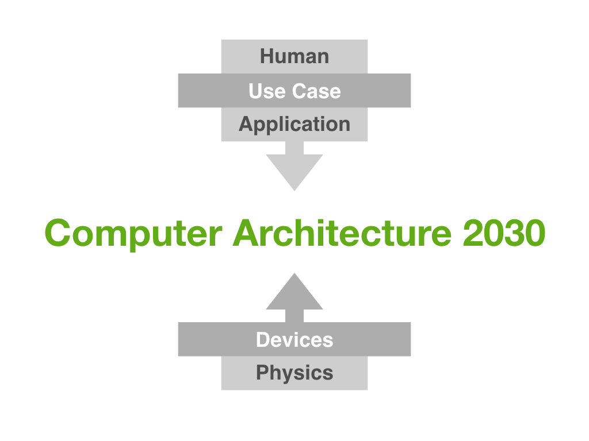

 

# Architecture 2030 Workshop @ ISCA 2016
{:.no_toc}

Please participate by filling out our [survey](http://goo.gl/forms/2Fc6beZyIR) by April 30!

Over the course of 2010-2012, the computer architecture research community, with the support of the Computer Research Association’s (CRA) Computing Community Consortium (CCC), carried out a series of visioning exercises to articulate how architectural innovation will continue to impact computing systems and society at large, identify new challenges and opportunities for architecture research, and provide guidance to funding agencies on critical priorities within our discipline and how architecture innovation can further other agency objectives.  These visioning activities lead to several highly influential reports, including the National Academy report  [The Future of Computing Performance: Game Over or Next Level? (2011)](http://www.nap.edu/catalog/12980/the-future-of-computing-performance-game-over-or-next-level) and the CCC community whitepaper [21st Century Computer Architecture (2012)](http://cra.org/ccc/docs/init/21stcenturyarchitecturewhitepaper.pdf).  These community-driven efforts contributed to the establishment of funding programs and new major research efforts. 

A key theme of these reports was the observation that Dennard Scaling is no longer viable.  As a result, architectural innovation, rather than semiconductor technology improvement, will be the key driver of continued advancement in the capability of computer systems. Several years have past since the conclusion of these visioning activities.  As we embark upon the post-Dennard era and look towards a post-CMOS life, new themes and priorities are ascendant in the architecture research community. As our field rapidly evolves, we believe it is time to initiate a new community effort to (1) identify the architectural challenges and opportunities of the next fifteen years and (2) reiterate and emphasize the criticality of architecture research to the future of computing to the agencies and companies that support computing research.

 <!-- Highly capable computing devices are appearing in ever more diverse deployments and devices, from tiny sensors in the Internet of Things to warehouse-scale systems in data centers.  All systems are now parallel computing systems. Heterogeneity is manifest throughout the architecture.  Approximate computing has emerged as a cross-cutting theme.  New memory and interconnect technologies have reached the cusp of commercial availability.  Security remains an unsolved and increasingly critical challenge.  New applications in computer vision, data science, and machine learning have emerged, leading to a surge in the study of accelerators and application-optimized architectures.  -->
 
The goal of this first Architecture 2030 Workshop is to kick off a new round of visioning activities in a public forum, on where our constituents believe the field is headed, what challenges and opportunities exist, and how we can continue to communicate our impact beyond our discipline. The workshop will be mostly discussion based, with breakout sessions and report-outs. I will also include two keynotes, one on devices and one on applications. Please participate by filling out our [survey](http://goo.gl/forms/2Fc6beZyIR), which will be used to guide our activities. The workshop will be on Sunday, June 19th.

## **Agenda for Sunday, June 19**

| Time | Event|
| :------| :-----------|
| 8:30 | Intro remarks by Luis Ceze and Tom Wenisch |
| 9:10 | [Mark Hill](http://pages.cs.wisc.edu/~markhill/) (Wisconsin) on "21st Century Computer Architecture" |
| 9:30 | *Devices Keynote:* [Philip Wong](http://web.stanford.edu/~hspwong/) (Stanford) on "Device Technologies for the N3XT 1,000X Improvement in Computing Performance" |
| 10:30 | *Break* |
| 11:00 | [Tom Conte](http://www.conte.us) (GeorgiaTech) on "IEEE Rebooting Computing Initiative & International Roadmap of Devices and Systems" |
| 11:20 | [Steve Keckler](http://www.cs.utexas.edu/~skeckler/) (nVidia/UT Austin) on “The Influence of Academic Research on Industry R&D” |
| 11:45 | [Alvy Lebeck](https://users.cs.duke.edu/~alvy/) (Duke) on “Computing and Biomolecules” |
| 12:05 | [Yuan Xie](http://www.ece.ucsb.edu/~yuanxie/) (UCSB) on "Technology-driven Architecture Innovation: Challenges and Opportunities" |
| 12:30 | *Lunch* |
| 2:00 | *Applications Keynote:* [Kayvon Fatahalian](https://www.cs.cmu.edu/~kayvonf/) (CMU) on "100 Quadrillion Live Pixels: The Challenge of Continuously Interpreting, Organizing, and Generating the World's Visual Information"  |
| 3:00 | Breakout session kick off |
| 3:30 | *Coffee Break* |
| 4:00 | Break-out session |
| 5:00 | Report-out/discussion |
| 5:30 | Wrap-up |

## **Organizers**

* [Luis Ceze](https://homes.cs.washington.edu/~luisceze/)
* [Thomas Wenisch](http://web.eecs.umich.edu/~twenisch/)
* [Mark Hill](http://pages.cs.wisc.edu/~markhill/) (Advisor and CCC Liaison)

This workshop is supported by the CCC. 

## Talk abstracts

### *21st Century Computer Architecture*

Mark D. Hill
 
This talk will briefly review the content, process, and influence of the 2012 [CCC](http://cra.org/ccc/) [white paper](http://cra.org/ccc/docs/init/21stcenturyarchitecturewhitepaper.pdf) that Mark Hill led together with Sarita Adve, Luis Ceze, Mary Jane Irwin, David Kaeli (IEEE TCCA), Margaret Martonosi, Josep Torrellas, Thomas Wenisch,  David Wood (ACM SIGARCH), & Katherine Yelick.
 

### *Device Technologies for the N3XT 1,000X Improvement in Computing Performance*

H.-S. Philip Wong, Department of Electrical Engineering and Stanford SystemX Alliance\\
Stanford University
	
21st century information technology (IT) must process, understand, classify, and organize the vast amount of data in real-time. 21st century applications will be dominated by memory-centric computing operating on Tbytes of active data with little data locality. At the same time, massively redundant sensor arrays sampling the world around us will give humans the perception of additional “senses” blurring the boundary between biological, physical, and cyber worlds. Abundant-data processing, which comprises real-time big-data analytics and the processing of perceptual data in wearable devices, clearly demands computation efficiencies well beyond what can be achieved through business as usual.

The key elements of a scalable, fast, and energy-efficient computation platform that may provide another 1,000× in computing performance (energy-execution time product) for future computing workloads are: massive on-chip memory co-located with highly energy-efficient computation, enabled by monolithic 3D integration using ultra-dense and fine-grained massive connectivity. There will be multiple layers of analog and digital memories interleaved with computing logic, sensors, and application-specific devices.  We call this technology platform N3XT – Nanoengineered Computing Systems Technology. N3XT will support computing architectures that embrace sparsity, stochasticity, and device variability.

In this talk, I will give an overview of nanoscale memory and logic technologies for implementing N3XT. I will give examples of nanosystems that have been built using these technologies, and provide projections on their eventual performance.

